# Appendix A - State machine va action matrix

## 1) State machine tour

```mermaid
flowchart LR
newSale[TourBan]
waitingOps[ChoNhanDieuHanh]
opsAccepted[DaNhanDieuHanh]
budgeting[DangDuToan]
handover[DangBanGiaoHDV]
guideAccepted[HDVDaNhan]
onTour[DangDienRa]
ended[KetThucChoQuyetToan]
guideSettled[HDVDaQuyetToan]
refundPending[ChuaHoanTien]
completed[ThanhCong]

newSale --> waitingOps
waitingOps --> opsAccepted
opsAccepted --> budgeting
budgeting --> handover
handover --> guideAccepted
guideAccepted --> onTour
onTour --> ended
ended --> guideSettled
guideSettled --> refundPending
refundPending --> completed
```

## 2) Action matrix theo trang thai

| Trang thai | Entry criteria | Exit criteria | NV Dieu hanh | Giam doc/Quan ly |
|---|---|---|---|---|
| Cho nhan | Tour da ban thanh cong, da co thong tin co ban | Co nguoi nhan dieu hanh | Nhan tour | Xem |
| Da nhan | NVĐH duoc gan phu trach | Bat dau du toan | Bat dau du toan | Xem |
| Dang du toan | Da co du lieu lich trinh va gia tri du kien | Chot du toan hop le | Cap nhat du toan, Chot du toan | Xem, phe duyet neu can |
| Dang ban giao HDV | Du toan da chot, ho so ban giao day du | HDV xac nhan nhan tour | Tao bo ho so 9 file, gui HDV | Xem |
| HDV da nhan | HDV xac nhan thanh cong | Tour khoi hanh va sang dang dien ra | Theo doi checklist HDV | Xem |
| Dang dien ra | Tour da khoi hanh | Tour ket thuc thuc te | Xu ly phat sinh | Xem |
| Ket thuc cho quyet toan | Tour da ket thuc | HDV nop quyet toan | Nhac HDV nop quyet toan | Xem |
| HDV da quyet toan | Ho so quyet toan da nop | Duyet quyet toan xong | Kiem tra chung tu, de nghi hoan/thu | Xem, phe duyet |
| Chua hoan tien | Quyết toan da duyet, chua thanh toan cuoi cung | Da hoan/thu tien xong | Thuc hien thanh toan/hoan tien | Xem |
| Thanh cong | Da hoan tat tai chinh | Khong co | Archive, dong ho so | Xem, thong ke |

## 3) Rule thanh toan dich vu

- `paid_amount = 0` -> `UNPAID` (Chua thanh toan).
- `0 < paid_amount < total_amount` -> `DEPOSITED` (Da coc).
- `paid_amount >= total_amount` -> `PAID_FULL` (Da thanh toan du).
- `is_overdue = true` khi `today > due_date` va `payment_status != PAID_FULL`.
- Overdue hien badge do o list dich vu va dashboard.

### Truong hop ngoai le

- Hoan/can tru: tao giao dich am trong `PaymentTransaction`, cap nhat `paid_amount`.
- Thanh toan du nhung co dieu chinh chi phi: cap nhat `total_amount` moi, tinh lai trang thai.
- Khoa cap nhat khi chung tu dang duoc phe duyet boi quan ly.

## 4) Rule phieu dat dich vu

State de xuat:

- `DRAFT`: tao moi, chua gui NCC.
- `SENT`: da gui NCC.
- `PARTIAL_CONFIRMED`: xac nhan mot phan (so luong/khung gio/chuoi dich vu chua du).
- `CONFIRMED`: NCC xac nhan day du.
- `CLOSED`: da su dung va chot.
- `CANCELLED`: huy co ly do.

Quy tac:

- File xac nhan la bat buoc khi chuyen sang `CONFIRMED`.
- Chi NVĐH phu trach tour moi duoc cap nhat phieu.
- Quan ly chi doc va duyet ngoai le (huy sat ngay su dung, thay doi lon ve gia).

## 5) Rule quyet toan HDV va hoan tien

- Dau vao bat buoc: bang ke chi phi, hoa don/chung tu, doi chieu tam ung, bien ban hoan tra dung cu (neu co).
- Duyet quyet toan:
  - NVĐH tiep nhan va doi chieu.
  - Quan ly duyet (neu vuot nguong chi phi/chenh lech).
- Ket qua:
  - Hoan tien cho HDV neu cong no duong.
  - Thu hoi tu HDV neu cong no am.
- Chi khi giao dich tai chinh cuoi cung hoan tat moi chuyen sang `Thanh cong`.
